<div align="center">

# TurfPlay

### AI-assisted sports facility booking for courts, turfs, equipment, and memberships

[](frontend/package.json)
[](frontend/package.json)
[](backend/api/main.py)
[](backend/database/mongodb.py)
[](frontend/package.json)

</div>

TurfPlay is a full-stack sports-facility booking application. Customers can create an account, browse active facilities, check availability, request a price quote, book a slot, attach equipment rentals, manage memberships, and cancel or reschedule eligible bookings. An authenticated assistant accepts text requests and can also use local speech-to-text and text-to-speech services.

> **Implementation status:** This README describes the code currently in the repository. Production hosting, CI/CD, payments, rate limiting, and a formal backend dependency manifest are not currently defined in the repository.

## 📚 Table of Contents

- [✨ Features](#-features)
- [🧠 How It Works](#-how-it-works)
- [🏗️ System Architecture](#️-system-architecture)
- [🔄 Application Flow](#-application-flow)
- [🔐 Authentication](#-authentication)
- [👤 User Journey](#-user-journey)
- [🤖 AI, RAG, and Voice](#-ai-rag-and-voice)
- [🗄️ Database Architecture](#️-database-architecture)
- [🔌 API Reference](#-api-reference)
- [🎨 Frontend Architecture](#-frontend-architecture)
- [📁 Project Structure](#-project-structure)
- [🛠️ Technology Stack](#️-technology-stack)
- [⚙️ Installation](#️-installation)
- [🧪 Testing](#-testing)
- [🛡️ Security](#️-security)
- [⚠️ Error Handling](#️-error-handling)
- [☁️ Deployment](#️-deployment)
- [📈 Performance](#-performance)
- [🔮 Roadmap](#-roadmap)
- [🐛 Troubleshooting](#-troubleshooting)
- [🤝 Contributing](#-contributing)
- [📸 Screenshots](#-screenshots)
- [📜 License and Author](#-license-and-author)

## ✨ Features

- 🔐 **Customer authentication**: signup, login with email or phone, session lookup, logout, bcrypt password hashing, and protected routes.
- 🏟️ **Facility discovery**: list active badminton courts, football turfs, tennis courts, and multipurpose rooms.
- 🕒 **Availability checks**: validate requested date/time ranges against operating hours, closures, and active bookings.
- 💰 **Pricing**: calculate base price, peak and weekend surcharges, membership discounts, equipment charges, deposits, and totals.
- 📅 **Booking management**: create, list, inspect, add equipment to, cancel, and reschedule bookings.
- 🎒 **Equipment rental**: browse available equipment, check quantities, reserve against an active booking, and release rentals through assistant flows.
- 🎟️ **Memberships**: view the current membership, list available plans, and subscribe to a plan.
- 🤖 **Assistant**: route requests through CrewAI specialist agents for booking, cancellation, rescheduling, equipment, customer, and knowledge tasks.
- 📚 **Knowledge-base answers**: retrieve relevant chunks with FAISS and Ollama embeddings, then generate a grounded answer with Groq.
- 🎙️ **Voice interaction**: transcribe browser audio with Faster Whisper and synthesize WAV audio with Piper.
- 📧 **Email notifications**: send booking confirmation, rescheduling, cancellation, and equipment-reservation emails over SMTP. Email failures are isolated from the main booking flow.
- 🧾 **Operational records**: write audit events, booking records, payment/refund state, facility closures, memberships, and equipment rentals to MongoDB.
- 📱 **Responsive web UI**: Next.js App Router pages for dashboard, booking, booking details, memberships, profile, and assistant views.

## 🧠 How It Works

1. A customer signs up or logs in from the Next.js frontend.
2. FastAPI validates the request and stores or checks the customer in MongoDB.
3. Successful authentication returns a generated bearer token. The frontend stores it under `turf_auth_token` in `localStorage`.
4. Protected frontend requests send `Authorization: Bearer <token>` to the FastAPI backend.
5. Route handlers delegate to services for availability, pricing, booking, cancellation, rescheduling, membership, equipment, and notifications.
6. The service layer reads and writes MongoDB documents and returns JSON contracts consumed by the frontend.
7. Assistant requests are classified by the manager agent and routed to specialist crews. Knowledge requests additionally use local vector retrieval and Groq generation.
8. The frontend updates its loading, success, empty, and error states from the API response.

## 🏗️ System Architecture

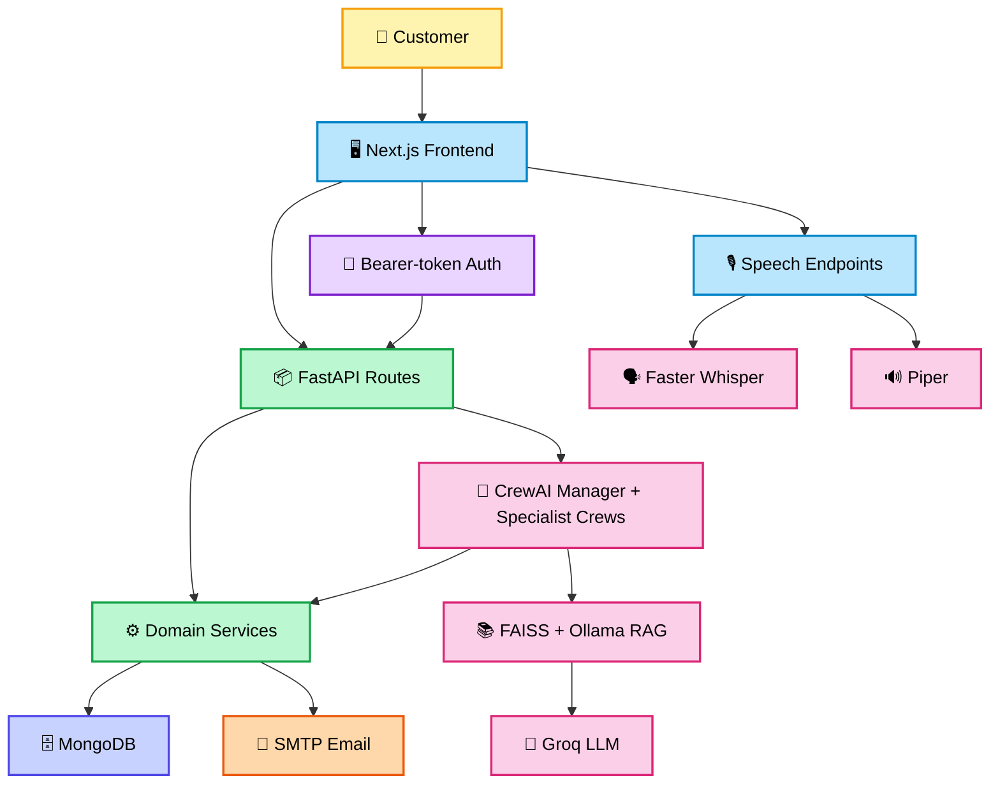

The repository does not contain a deployment topology, Dockerfile, reverse-proxy configuration, or infrastructure-as-code. The diagram above is the application architecture, not a claim about a hosted environment.

## 🔄 Application Flow

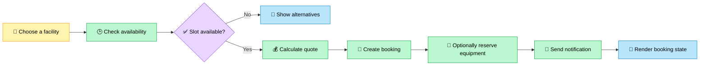

## 🔐 Authentication

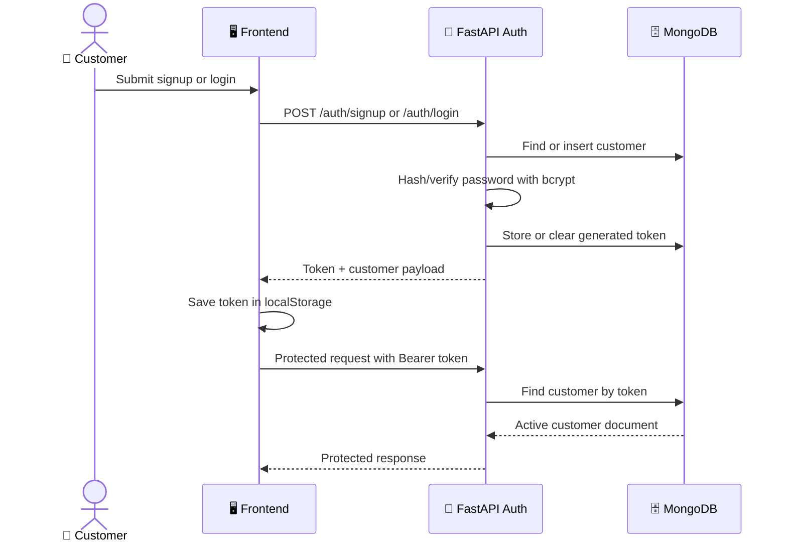

- Signup requires `name`, `email`, `phone`, and `password`; passwords must contain at least six characters.
- Login accepts an email or phone in `identifier` plus a password.
- Passwords are stored as bcrypt hashes, never as the submitted plaintext.
- Tokens are random `uuid.uuid4().hex` values stored on the customer document. They are opaque database-backed session tokens, not JWTs.
- Protected routes require a valid `Authorization: Bearer ...` header and an active customer account.
- The frontend redirects to `/login` after a `401` response and clears its local token.
- Logout unsets the stored token in MongoDB and clears the browser token.
- There is no configured token expiration, refresh-token flow, role model, rate limiting, or CSRF protection in the current implementation.

## 👤 User Journey

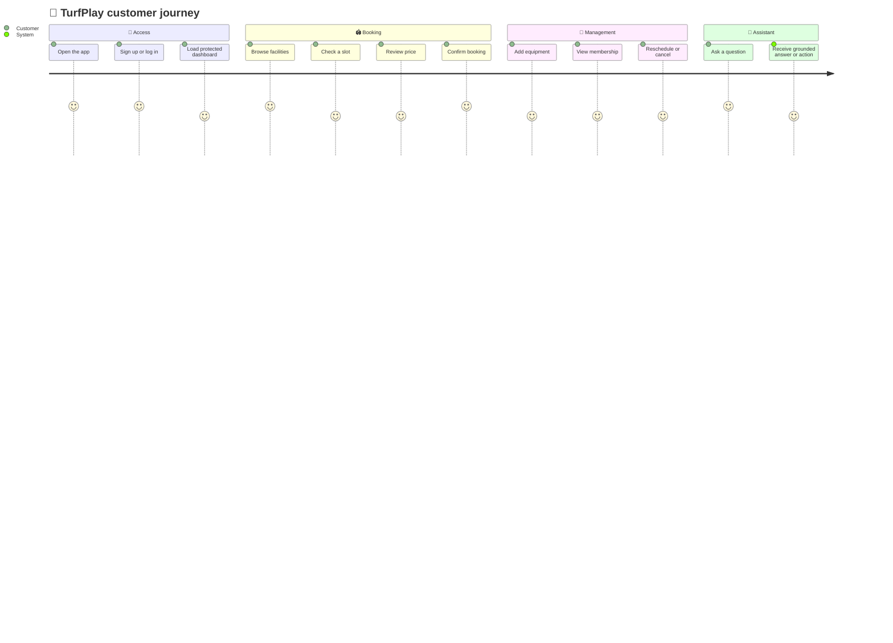

## 🤖 AI, RAG, and Voice

### Assistant routing

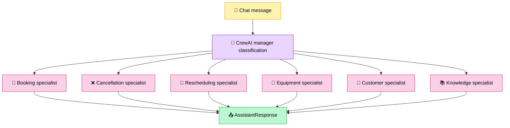

The manager serializes assistant processing with a thread lock, classifies the text, and calls `route_classified_request`. Specialist business processes, rather than the LLM, perform MongoDB mutations. Assistant responses can contain text, availability, booking summaries, price breakdowns, cancellation confirmation, rescheduling forms, or action buttons.

### Knowledge-base RAG


RAG is used for facility knowledge questions, not as the source of truth for booking availability or price calculations. The index and chunks are expected at `data/rag/vectorstore/vectors.index` and `data/rag/vectorstore/chunks.pkl`. `backend/rag/create_vectorstore.py` and `backend/rag/chunk_documents.py` support building the artifacts.

### Voice flow

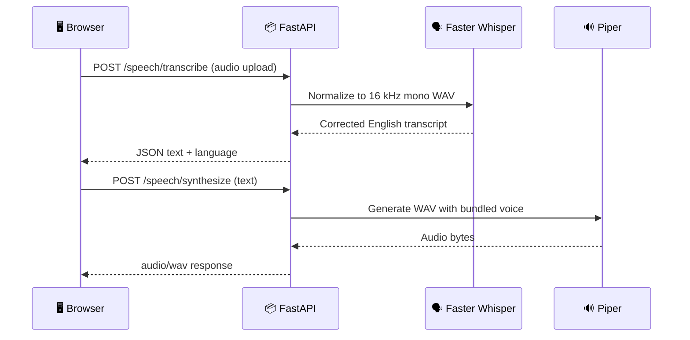

## 🗄️ Database Architecture

MongoDB is accessed through `pymongo.MongoClient`. The database defaults to `turf_booking` and the application uses the following collections:

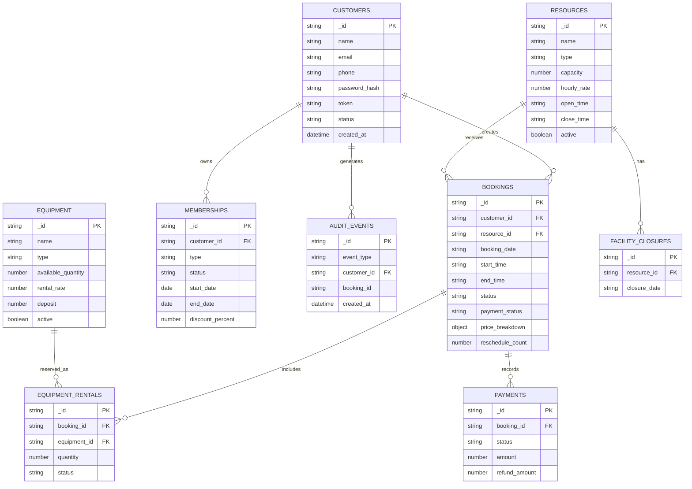

The relations shown are application-level references; MongoDB does not enforce foreign keys. Customer and resource IDs are application-generated strings. The repository does not define an index migration or schema validation configuration. `backend/database/migrate_booking_ids.py` is a one-off migration utility for booking IDs.

### Database request flow

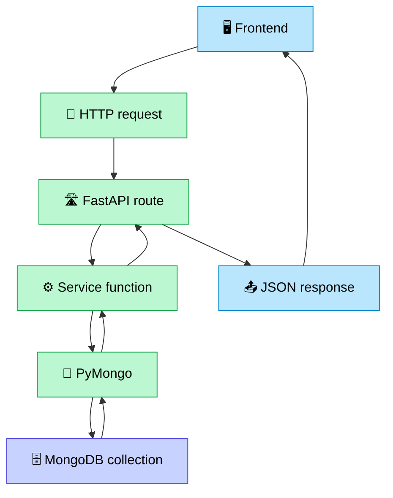

## 🔄 Booking Lifecycle

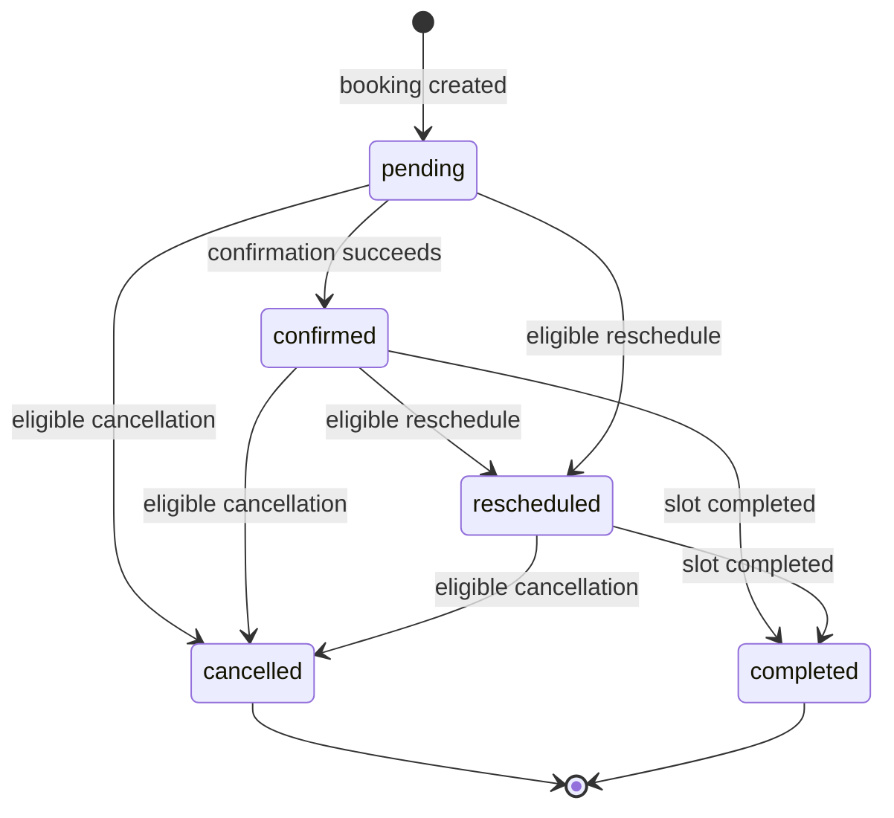

Active availability checks consider `pending` and `confirmed` bookings. Equipment rentals also consider `rescheduled` bookings active. Cancellation and rescheduling are guarded by status, ownership, timing rules, and confirmation.

## 🧠 Backend Architecture

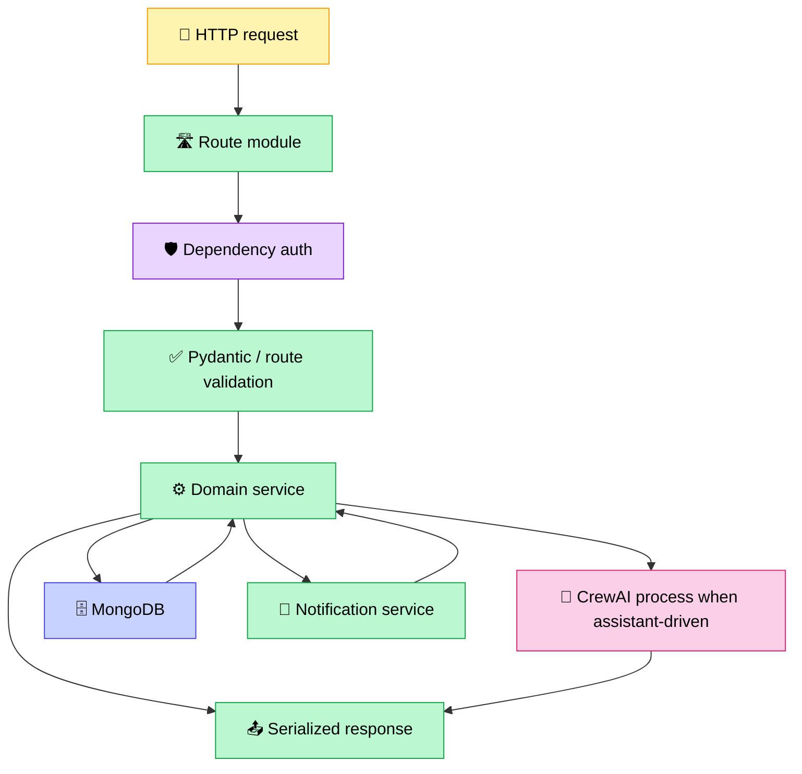

`backend/api/routes` owns HTTP contracts. `backend/services` owns business rules and persistence operations. `backend/agents` coordinates conversational workflows and calls services/tools. `backend/tools` exposes selected domain operations to CrewAI. FastAPI converts `HTTPException` details into consistent JSON with `error_code` and `message` fields where route code supplies them.

## 🎨 Frontend Architecture

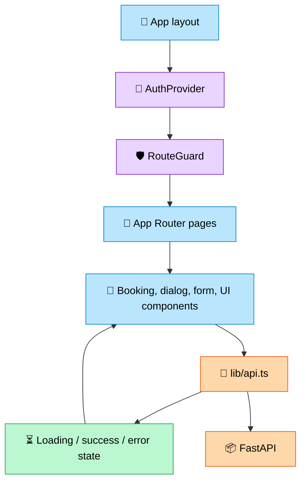

Routes include `/`, `/login`, `/signup`, `/dashboard`, `/book`, `/book/[facilityId]`, `/bookings`, `/bookings/[bookingId]`, `/membership`, `/profile`, and `/assistant`. The API helper centralizes base URL resolution, bearer headers, JSON parsing, network errors, and global `401` handling. There is no separate frontend state library; auth state is held by `AuthProvider` and page-level state/hooks.

## 🔌 API Reference

The backend listens on port `8002` in the documented local command. All routes below require a bearer token unless marked **No**.

| Method | Endpoint | Auth | Purpose |
|---|---|---:|---|
| GET | `/` | No | API status message |
| GET | `/health` | No | Health response |
| POST | `/auth/signup` | No | Register and start a session |
| POST | `/auth/login` | No | Login with email or phone |
| GET | `/auth/me` | Yes | Return current customer |
| POST | `/auth/logout` | Yes | Invalidate current token |
| GET | `/resources` | Yes | List active facilities |
| GET | `/resources/{resource_id}` | Yes | Get one facility |
| GET | `/resources/{resource_id}/availability` | Yes | Check date/time availability; query: `date`, `start_time`, `end_time` |
| POST | `/pricing/quote` | Yes | Calculate a booking quote |
| POST | `/bookings` | Yes | Create a booking |
| GET | `/bookings` | Yes | List customer bookings; optional `status` filter |
| GET | `/bookings/{booking_id}` | Yes | Get one owned booking |
| POST | `/bookings/{booking_id}/equipment` | Yes | Add equipment rental |
| POST | `/bookings/{booking_id}/cancel-preview` | Yes | Preview cancellation/refund |
| POST | `/bookings/{booking_id}/cancel` | Yes | Cancel a booking |
| POST | `/bookings/{booking_id}/reschedule-preview` | Yes | Preview a reschedule |
| POST | `/bookings/{booking_id}/reschedule` | Yes | Reschedule a booking |
| GET | `/equipment` | Yes | List active equipment |
| GET | `/equipment/availability` | Yes | Query equipment availability; `equipment_id`, `quantity` |
| GET | `/membership` | Yes | Return latest customer membership |
| GET | `/membership/plans` | Yes | List membership plans |
| POST | `/membership/subscribe` | Yes | Subscribe to `monthly` or `annual` plan |
| POST | `/assistant/chat` | Yes | Process an assistant message |
| POST | `/assistant/equipment/confirm` | Yes | Confirm equipment action from assistant |
| POST | `/speech/transcribe` | No | Upload audio and return transcript |
| POST | `/speech/synthesize` | No | Return generated `audio/wav` |

### Request examples

```json
POST /auth/login
{
	"identifier": "customer@example.com",
	"password": "your-password"
}
```

```json
POST /bookings
Authorization: Bearer <token>

{
	"resource_id": "BC1",
	"date": "2026-10-01",
	"start_time": "18:00",
	"end_time": "19:00",
	"equipment": [],
	"apply_membership": false
}
```

```json
POST /assistant/chat
Authorization: Bearer <token>

{
	"message": "Is a badminton court available tomorrow at 6pm?",
	"conversation_id": "optional-client-id"
}
```

### API communication flow

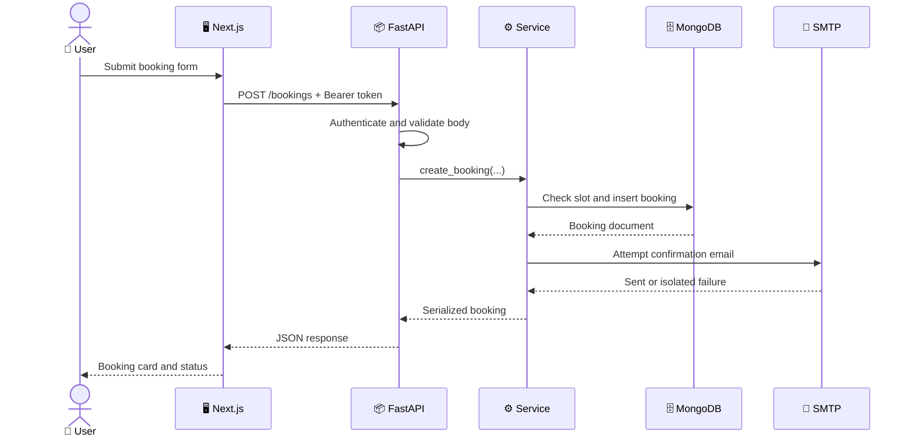

## 📁 Project Structure

```text
Turf Booking Agent/
├── backend/
│   ├── agents/                 # CrewAI agents, tasks, crews, and domain processes
│   ├── api/
│   │   ├── main.py             # FastAPI app, CORS, exception handler, routers
│   │   ├── dependencies.py      # Bearer-token customer dependency
│   │   └── routes/              # Auth, resources, bookings, chat, equipment, etc.
│   ├── database/                # MongoDB connection and booking-ID migration
│   ├── rag/                     # Chunking, FAISS index creation, retrieval, generation
│   ├── services/                # Business logic and external-service adapters
│   ├── tools/                   # CrewAI domain tools
│   └── seed_resources.py        # Inserts sample facilities
├── data/
│   ├── knowledge_base/          # Facility policy and information text
│   └── rag/vectorstore/         # Generated FAISS index and pickled chunks
├── frontend/
│   ├── app/                     # Next.js App Router pages and layouts
│   ├── components/              # App shell, forms, dialogs, cards, UI primitives
│   ├── lib/                     # API client, types, formatting, hooks, errors
│   └── package.json             # Frontend dependencies and scripts
├── tests/                       # Pytest unit, integration, and API contract tests
├── voices/                      # Bundled Piper voice model files
├── Mongodb Data/                # Local JSON data files
├── PRD/                         # Product and frontend/backend requirement documents
├── Booking.txt                  # Earlier booking-flow notes and backend command
├── Groq.txt                    # Groq credential note; do not commit secrets
├── requirements.txt             # Currently empty; backend dependencies are not pinned
└── README.md
```

Generated/local directories such as `venv/`, `.pytest_cache/`, and `frontend/.next/` are development artifacts and should not be treated as source modules.

## 🛠️ Technology Stack

| Layer | Technology | Role |
|---|---|---|
| Frontend | Next.js 16.3.3, React 19, TypeScript 5.7.3 | App Router UI and client-side interactions |
| UI | Tailwind CSS 4, shadcn/base-ui components, Lucide, Sonner | Styling, primitives, icons, notifications |
| Backend | FastAPI | HTTP API, routing, validation, CORS |
| Persistence | MongoDB via PyMongo | Customers, bookings, resources, memberships, rentals, payments, audit events |
| Auth | bcrypt + opaque MongoDB token | Password hashing and session lookup |
| Agents | CrewAI | Manager and specialist conversational workflows |
| LLM | Groq OpenAI-compatible API, `openai/gpt-oss-20b` | Classification/knowledge answer generation |
| RAG | Ollama `nomic-embed-text` + FAISS | Local embeddings and top-k knowledge retrieval |
| Speech | Faster Whisper + Piper + pydub | Local speech-to-text and text-to-speech |
| Email | Python SMTP client | Booking and equipment notifications |
| Analytics | `@vercel/analytics` in production frontend | Frontend analytics component |

## ⚙️ Installation

### Prerequisites

- Node.js compatible with the installed Next.js 16 toolchain.
- `pnpm` 12.3.4, as declared by `frontend/package.json`.
- Python with a working virtual environment. A Python version is not pinned in the repository.
- MongoDB, either a reachable MongoDB Atlas cluster or a local MongoDB instance.
- Ollama with the `nomic-embed-text` model for RAG.
- System audio tooling supported by `pydub` for browser-audio conversion.
- Git.

### Clone and configure

```bash
git clone <repository-url>
cd "Turf Booking Agent"
```

Create a backend `.env` at the repository root. Do not copy credentials from committed notes or expose them in source control:

```dotenv
MONGODB_URI=mongodb://localhost:27017/
MONGODB_DATABASE=turf_booking
GROQ_API_KEY=replace-with-your-groq-key
SMTP_HOST=smtp.gmail.com
SMTP_PORT=587
SMTP_USER=replace-with-smtp-user
SMTP_PASS=replace-with-smtp-app-password
SMTP_FROM=replace-with-sender
```

Create `frontend/.env.local`:

```dotenv
NEXT_PUBLIC_API_BASE_URL=http://localhost:8002
```

### Backend

`requirements.txt` is currently empty, so there is no reproducible backend install command supplied by the repository. Install the packages required by the imports, then pin them in `requirements.txt` before deployment. At minimum, the implementation imports FastAPI, Uvicorn, PyMongo, python-dotenv, Pydantic, bcrypt, CrewAI, Groq, Ollama, FAISS, NumPy, Faster Whisper, Piper, and pydub.

```bash
python -m venv .venv
\.venv\Scripts\activate        # Windows PowerShell
python -m pip install --upgrade pip
# Install the backend packages required by the imports, then run:
python -m uvicorn backend.api.main:app --host 127.0.0.1 --port 8002
```

Seed the sample resources from the repository root after configuring MongoDB:

```bash
python backend/seed_resources.py
```

The RAG runtime expects the prebuilt files under `data/rag/vectorstore/`. Build or refresh them with the scripts in `backend/rag/` when the knowledge-base content changes. Start Ollama and make the embedding model available before using knowledge queries.

### Frontend

```bash
cd frontend
pnpm install
pnpm dev
```

The frontend normally starts at `http://localhost:3000`. The backend is `http://127.0.0.1:8002`, with health check `http://127.0.0.1:8002/health`.

## 🔑 Environment Variables

| Variable | Required by | Purpose |
|---|---|---|
| `MONGODB_URI` | Backend | MongoDB connection string |
| `MONGODB_DATABASE` | Backend | Database name; defaults to `turf_booking` |
| `GROQ_API_KEY` | Agents and RAG | Groq API authentication |
| `SMTP_HOST` | Email service | SMTP server; defaults to `smtp.gmail.com` |
| `SMTP_PORT` | Email service | SMTP port; defaults to `587` |
| `SMTP_USER` | Email service | SMTP login user |
| `SMTP_PASS` | Email service | SMTP password or app password |
| `SMTP_FROM` | Email service | Sender address; defaults to `SMTP_USER` |
| `NEXT_PUBLIC_API_BASE_URL` | Frontend | FastAPI base URL |

> **Never commit `.env`, `.env.local`, API keys, database URLs, SMTP passwords, or generated private credentials.** Credentials have existed in local repository files during development; rotate any credential that may have been exposed and remove it from Git history before publishing the repository.

## 🧪 Testing

The backend test suite uses `pytest` and includes service tests plus FastAPI `TestClient` contract tests:

```bash
python -m pytest
```

Focused examples:

```bash
python -m pytest tests/test_api_contract.py
python -m pytest tests/test_booking.py tests/test_cancellation.py tests/test_reschedule.py
python -m pytest tests/test_equipment.py tests/test_membership.py tests/test_pricing.py
```

The tests cover authentication, availability, booking, confirmation, cancellation, email notification behavior, equipment, membership, pricing, rescheduling, API contracts, and a real-email test module. The real-email test should only be run with an intentionally configured test SMTP account. There is no frontend test script or browser automation suite in `frontend/package.json`.

## 🛡️ Security

### Implemented

- Passwords are hashed and verified with bcrypt.
- Protected API routes require a bearer token mapped to an active MongoDB customer.
- Booking reads and mutations check the authenticated customer ID in route/service flows.
- Pydantic request models validate the primary JSON payloads.
- API keys and database/SMTP configuration are loaded from environment variables.
- Assistant specialist prompts explicitly separate knowledge answers from booking mutations.
- Email failures are caught so notification failure does not break the main booking operation.

### Current risks and production work

- FastAPI CORS currently allows all origins, methods, headers, and credentials. Restrict these values before production.
- Session tokens are stored in browser `localStorage`, which increases exposure to XSS. HttpOnly, Secure, SameSite cookies are a stronger production option.
- Tokens have no expiry or refresh mechanism.
- No rate limiting, account lockout, CSRF strategy, security headers, structured secret manager, or audit-log access policy is configured.
- `requirements.txt` is empty, so dependency versions are not reproducible.
- MongoDB connection creation does not define explicit pool, timeout, TLS, or retry settings in repository code.
- Payment records and refunds are represented in MongoDB logic, but no external payment processor is integrated.

## ⚠️ Error Handling

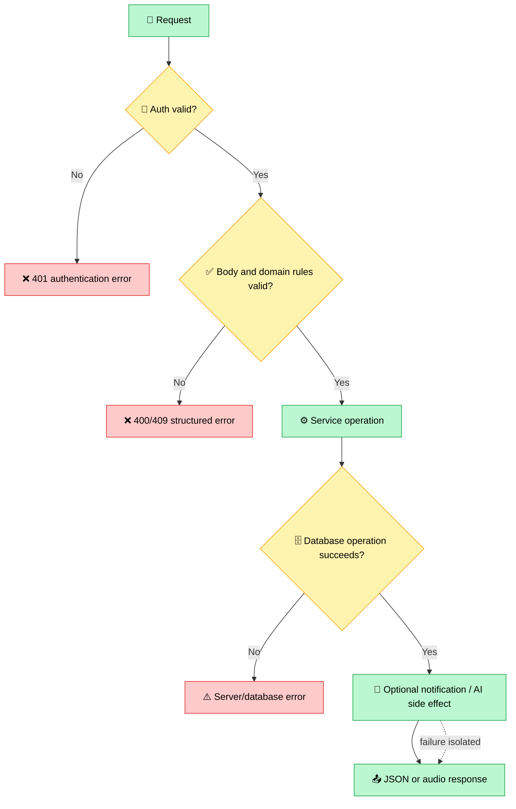

The frontend converts network failures into `NETWORK_ERROR`, missing API configuration into `MISSING_API_URL`, and non-2xx responses into `ApiError`. FastAPI's global `HTTPException` handler preserves dictionary details or wraps plain details as `{ "error_code": "HTTP_ERROR", "message": "..." }`. Assistant failures are logged and converted into a user-facing text response. RAG, speech, database, and SMTP failures can still prevent the relevant feature from working; they are not a substitute for observability or retries.

## ☁️ Deployment

No production deployment provider, Dockerfile, CI workflow, or infrastructure definition is present. A deployment must therefore provide the following topology manually:

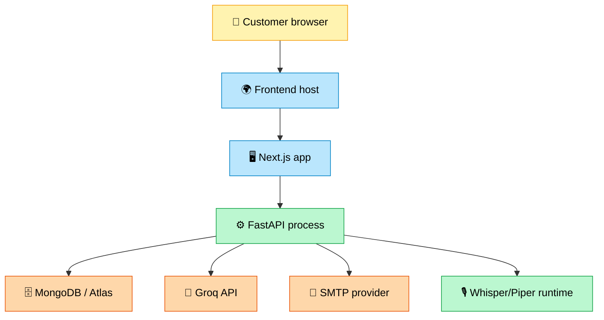

For production, configure HTTPS, a restricted frontend origin, secret injection, a process manager, health checks, MongoDB network access, persistent RAG/model assets, and a deployment-specific build/start command. The frontend production commands are `pnpm build` and `pnpm start`; a backend production command is not declared by the repository beyond the Uvicorn entry point.

## 📊 Data Flow and End-to-End Process

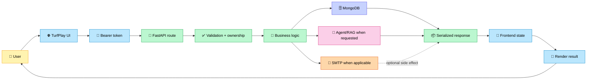

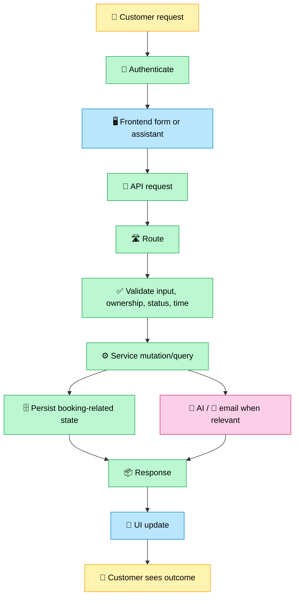

## 📈 Performance

### Present in the implementation

- Availability and booking operations use MongoDB queries scoped by resource/date/status.
- RAG retrieves only `TOP_K = 3` chunks before generation.
- Whisper and Piper models are loaded once at module import rather than per request.
- Frontend pages use loading states and shared API request handling.

### Not currently implemented

Caching, pagination, background job queues, distributed locks, database index definitions, request tracing, rate-based throttling, and AI response streaming are not configured. The assistant uses a process-local thread lock, which does not coordinate multiple backend workers.

## 🧱 Design Decisions

- **Next.js App Router** provides the frontend route structure and a single React application shell.
- **FastAPI** matches the Python service and agent ecosystem while providing typed request models and easy route composition.
- **MongoDB** fits the document-shaped booking, price-breakdown, membership, rental, and audit data used by the services.
- **Opaque database-backed tokens** keep auth implementation simple, but lack JWT features such as expiry claims and key rotation.
- **CrewAI + specialist processes** separates conversational classification from domain mutations.
- **FAISS + Ollama + Groq** keeps vector retrieval and embeddings local while delegating final natural-language generation to Groq.
- **Local Whisper/Piper** avoids requiring a hosted speech provider for the voice path, at the cost of larger runtime assets and CPU load.

## 🔮 Roadmap

- [x] Customer signup and login
- [x] Facility listing and availability
- [x] Pricing and booking creation
- [x] Cancellation and rescheduling previews
- [x] Equipment and membership flows
- [x] Assistant chat and knowledge-base RAG
- [x] Local speech transcription and synthesis
- [x] SMTP booking notifications
- [ ] Populate and pin `requirements.txt`
- [ ] Add automated frontend tests and CI
- [ ] Add production deployment configuration
- [ ] Restrict CORS and move sessions to secure HttpOnly cookies
- [ ] Add token expiry, rate limiting, monitoring, and database indexes
- [ ] Integrate a real payment provider

## 🐛 Troubleshooting

### `MISSING_API_URL` in the frontend

Set `NEXT_PUBLIC_API_BASE_URL` in `frontend/.env.local`, restart Next.js, and confirm the backend is reachable.

### MongoDB connection failure

Check `MONGODB_URI`, network access rules, credentials, and whether the selected database is available. The API imports the MongoDB connection at startup, so a bad configuration can prevent route startup.

### `GROQ_API_KEY is not set`

Set `GROQ_API_KEY` in the repository-root `.env`. Knowledge and agent modules validate this variable during import.

### RAG index or embedding errors

Confirm `data/rag/vectorstore/vectors.index` and `chunks.pkl` exist, start Ollama, and install the `nomic-embed-text` model. Rebuild artifacts with the scripts under `backend/rag/` if the knowledge base changed.

### Speech endpoint errors

The speech service loads Faster Whisper, Piper, and the bundled voice model during import. Confirm the voice files exist under `voices/` and that audio conversion dependencies required by pydub are available.

### Email authentication failure

Use an SMTP app password where the provider requires one. Check `SMTP_HOST`, `SMTP_PORT`, `SMTP_USER`, `SMTP_PASS`, and `SMTP_FROM`. Email errors are returned by the email service and should not normally cancel the booking operation.

### Port already in use

Run the backend on another port and update `NEXT_PUBLIC_API_BASE_URL` accordingly:

```bash
python -m uvicorn backend.api.main:app --host 127.0.0.1 --port 8010
```

## 🤝 Contributing

1. Fork the repository.
2. Create a focused branch.
3. Configure a test MongoDB database and non-production service credentials.
4. Make the change and add or update focused tests.
5. Run `python -m pytest` and `pnpm build` from the relevant project directories.
6. Commit and push the branch.
7. Open a pull request describing behavior changes, configuration changes, and test results.

Do not include `.env`, `.env.local`, credentials, real customer data, generated secrets, or production email recipients in a pull request.

## 📸 Screenshots

Screenshots are not currently stored in the repository. Suggested captures for future documentation:

- Login and signup
- Customer dashboard
- Facility and time-slot selection
- Booking details and price breakdown
- Cancellation/rescheduling preview
- Membership plans
- Assistant text and voice interaction

## 📜 License and Author

No license file, author profile, GitHub URL, LinkedIn URL, or portfolio URL is present in the repository. Licensing and attribution are therefore **not currently specified**. Add those details before publishing the project as an open-source repository.
